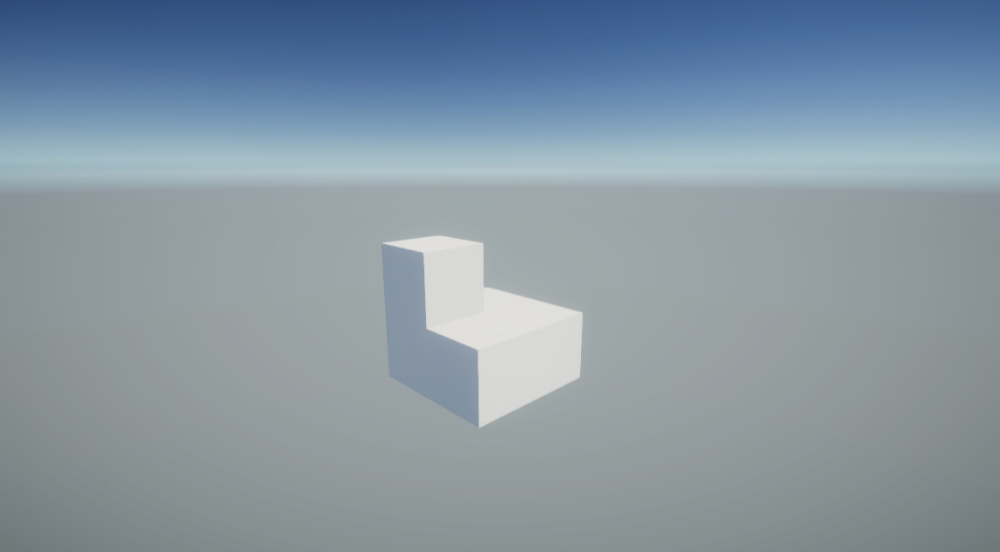
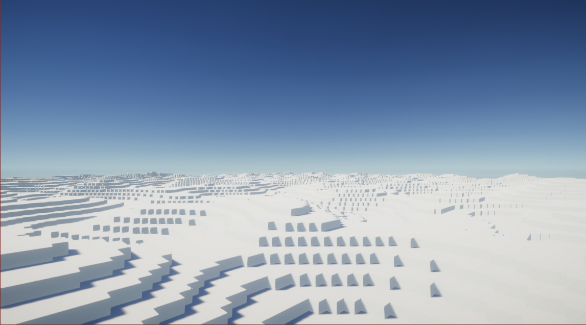
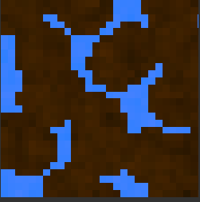

# Creating a Voxel Renderer
## 12/1/2020

The voxel engines in games like Minecraft and Infiniminer have been quite interesting to mess around with, but even more interesting when you know what goes on behind the curtains. They are not a series of cubes being spawned around you but are in fact just the outwards faces strung together to keep the cubey look while not having to render internal faces. In this article, I will try to implement a voxel renderer of my own. This is actually the third attempt at this project, as the first one was very buggy and the second used a texture atlas instead of submeshes for texturing.

### Creating a face

The first thing I needed to do was create a 1x1 quad. To do this was simple; all I needed to do was create vertexes and UV at all four corners and string them together with triangles. Here is the code that does that:

```cs
Mesh mesh = new Mesh();

        List<Vector3> verts = new List<Vector3>(); // vertices
        List<Vector2> uv = new List<Vector2>(); // uv coords
        List<List<int>> tris = new List<List<int>>(); // indexes of verts array; 
                                                     // every three = 1 triangle

        // this function makes it a lot easier to add tris
        void AddTri(int x,int y, int z, int submesh) {
            if (tris.Count<=submesh) {
                for(int i=0; tris.Count!=submesh+1; i++) {
                    tris.Add(new List<int>());
                }
            }
            tris[submesh].Add(x);
            tris[submesh].Add(y);
            tris[submesh].Add(z);
        }

        // creates a 1x1 face
        void CreateFace() {
            verts.Add(new Vector3(0, 0));
            verts.Add(new Vector3(0, 1));
            verts.Add(new Vector3(1, 1));
            verts.Add(new Vector3(1, 0));

            uv.Add(new Vector2(0, 0));
            uv.Add(new Vector2(0, 1));
            uv.Add(new Vector2(1, 1));
            uv.Add(new Vector2(1, 0));

            AddTri(0,1,2, 0);
            AddTri(2,3,0, 0);
        }

        CreateFace();

        // put data in mesh
        mesh.SetVertices(verts);
        mesh.SetUVs(0, uv);
        for(int i=0; i<tris.Count; i++) {
            /* triangle submeshes */
            // Different submeshes are controlled by different materials;
            // no need for a confusing texture atlas.
            mesh.SetTriangles(tris[i], i);
        }

        mesh.RecalculateBounds();
        mesh.RecalculateNormals();

        mf.mesh = mesh;

```

As you can see, I put quad creation in a local function. This is because I will be making quads a lot throughout the `Start()` method and want to keep my generator in a neat function. 

The next thing I want to do is change the direction that the quad is facing. To do this I will need some way of storing direction. I did this with an enum:

```cs
public enum Direction {
    // Pos = Positive
    // Neg = Negative
    PosX,
    NegX,
    PosZ,
    NegZ,
    PosY,
    NegY
}
```

Next, I need to change the positions of the vertices based on a `Direction` passed to `CreateFace()`. I will use a switch statement for this. Instead of calling `verts.Add()` in every case, however, I will set some variables with the coordinates of the vertices. This will be useful later:

```cs
ar bl = new Vector3(); // bottom left
            var tl = new Vector3(); // top left
            var tr = new Vector3(); // top right
            var br = new Vector3(); // bottom right

            switch(dir) {
                case Direction.PosX:
                    bl = new Vector3(1, 0);
                    tl = new Vector3(1, 1);
                    tr = new Vector3(1, 1, 1);
                    br = new Vector3(1, 0, 1);
                    break;
                case Direction.NegX:
                    bl = new Vector3(1, 0, 1);
                    tl = new Vector3(1, 1, 1);
                    tr = new Vector3(1, 1);
                    br = new Vector3(1, 0);
                    break;
                case Direction.PosY:
                    bl = new Vector3(0, 1, 1);
                    tl = new Vector3(1, 1, 1);
                    tr = new Vector3(1, 1);
                    br = new Vector3(0, 1);
                    break;
                case Direction.NegY:
                    bl = new Vector3(0, 1);
                    tl = new Vector3(1, 1);
                    tr = new Vector3(1, 1, 1);
                    br = new Vector3(0, 1, 1);
                    break;
                case Direction.PosZ:
                    bl = new Vector3(1, 0);
                    tl = new Vector3(1, 1);
                    tr = new Vector3(0, 1);
                    br = new Vector3(0, 0);
                    break;
                case Direction.NegZ:
                    bl = new Vector3(0, 0);
                    tl = new Vector3(0, 1);
                    tr = new Vector3(1, 1);
                    br = new Vector3(1, 0);
                    break;
            }
```

The last thing that I need to add to the function is position changing. It is quite simple, as all I need to do is offset all of the vertices by the given position:

```cs
verts.Add(pos + bl);
            verts.Add(pos + tl);
            verts.Add(pos + tr);
            verts.Add(pos + br);
```
Here is the full `CreateFace()` function:
```cs
// creates a 1x1 face
        void CreateFace(Direction dir, Vector3 pos) {
            int v0 = verts.Count; // bottom left
            int v1 = verts.Count+1; // top left
            int v2 = verts.Count+2; // top right
            int v3 = verts.Count+3; // bottom right

            var bl = new Vector3(); // bottom left
            var tl = new Vector3(); // top left
            var tr = new Vector3(); // top right
            var br = new Vector3(); // bottom right

            switch(dir) {
                case Direction.PosX:
                    bl = new Vector3(1, 0);
                    tl = new Vector3(1, 1);
                    tr = new Vector3(1, 1, 1);
                    br = new Vector3(1, 0, 1);
                    break;
                case Direction.NegX:
                    bl = new Vector3(1, 0, 1);
                    tl = new Vector3(1, 1, 1);
                    tr = new Vector3(1, 1);
                    br = new Vector3(1, 0);
                    break;
                case Direction.PosY:
                    bl = new Vector3(0, 1, 1);
                    tl = new Vector3(1, 1, 1);
                    tr = new Vector3(1, 1);
                    br = new Vector3(0, 1);
                    break;
                case Direction.NegY:
                    bl = new Vector3(0, 1);
                    tl = new Vector3(1, 1);
                    tr = new Vector3(1, 1, 1);
                    br = new Vector3(0, 1, 1);
                    break;
                case Direction.PosZ:
                    bl = new Vector3(1, 0);
                    tl = new Vector3(1, 1);
                    tr = new Vector3(0, 1);
                    br = new Vector3(0, 0);
                    break;
                case Direction.NegZ:
                    bl = new Vector3(0, 0);
                    tl = new Vector3(0, 1);
                    tr = new Vector3(1, 1);
                    br = new Vector3(1, 0);
                    break;
            }

            verts.Add(pos + bl);
            verts.Add(pos + tl);
            verts.Add(pos + tr);
            verts.Add(pos + br);

            uv.Add(new Vector2(0, 0));
            uv.Add(new Vector2(0, 1));
            uv.Add(new Vector2(1, 1));
            uv.Add(new Vector2(1, 0));

            AddTri(v0,v1,v2, 0);
            AddTri(v2,v3,v0, 0);
        }

```
And if you are curious, here are the calls for making a cube:
```cs
        CreateFace(Direction.PosX, new Vector3(0,0,0));
        CreateFace(Direction.NegX, new Vector3(-1,0,0));
        CreateFace(Direction.PosZ, new Vector3(0, 0, 1));
        CreateFace(Direction.NegZ, new Vector3(0, 0, 0));
        CreateFace(Direction.PosY, new Vector3(0, 0, 0));
        CreateFace(Direction.NegY, new Vector3(0, -1, 0));

```
So far this has made me rethink my definition of a virtual cube. It is not a solid object that clips when you get near it; it is a collection of triangles that only render on one side.
There are tons of ways I can optimize this function, by for example not making vertices where some already exist. But I feel like this function is fine, and will be using it in the future.

### Rendering voxels

To render the voxel environment, the world is made up of an NxNxN grid of chunks, each chunk containing 16x16x16 blocks. When a block in a chunk is changed, its mesh is recalculated to make up for the change. The reason I am not making the whole world a single chunk is that:

1. It would take too long to generate a mesh
2. All graphics cards have a limit to how many vertices can be on one mesh at a time.

But first, we need a way to store this grid of blocks. As I am taking a simple and functional approach to this project, I will be storing block data in an enumerator:

```cs
public enum BlockID {
    Stone,
    Air
}
```

Each chunk will have a `BlockID[,,]` stored in its script. In the `Start()` method it will be filled with `Air`, but for testing purposes, I will also put `Stone` in various locations. Here is the code that does that:

```cs
	blocks = new BlockID[Constants.chunkSize,Constants.chunkSize,Constants.chunkSize];
// fill chunk with air
        for (int x = 0; x < Constants.chunkSize; x++) {
            for (int y = 0; y < Constants.chunkSize; y++) {
                for (int z = 0; z < Constants.chunkSize; z++) {
                    blocks[x, y, z] = BlockID.Air;
                }
            }
        }
        // some test values
        blocks[0, 0, 0] = BlockID.Stone;
        blocks[1, 0, 0] = BlockID.Stone;
        blocks[0, 0, 1] = BlockID.Stone;
        blocks[1, 0, 1] = BlockID.Stone;
        blocks[1, 1, 0] = BlockID.Stone;

```

Now we need to make faces for the blocks. Since I already have the code for making the six faces of a cube, all I need to do is loop through every block and render faces based on its neighbors:

```cs
BlockID GetBlock(int x,int y,int z) {
            try {
                return blocks[x, y, z];
            } catch(System.IndexOutOfRangeException) {
                return BlockID.Air;
            }
        }

        for (int x = 0; x < blocks.GetLength(0); x++) {
            for (int y = 0; y < blocks.GetLength(1); y++) {
                for (int z = 0; z < blocks.GetLength(2); z++) {
                    if (blocks[x, y, z] == BlockID.Air) continue;
                    var pos = new Vector3(x, y, z);
                    if (GetBlock(x + 1, y, z) == BlockID.Air) CreateFace(Direction.PosX, pos + new Vector3(0, 0, 0));
                    if (GetBlock(x - 1, y, z) == BlockID.Air) CreateFace(Direction.NegX, pos + new Vector3(-1, 0, 0));
                    if (GetBlock(x, y, z + 1) == BlockID.Air) CreateFace(Direction.PosZ, pos + new Vector3(0, 0, 1));
                    if (GetBlock(x, y, z - 1) == BlockID.Air) CreateFace(Direction.NegZ, pos + new Vector3(0, 0, 0));
                    if (GetBlock(x, y + 1, z) == BlockID.Air) CreateFace(Direction.PosY, pos + new Vector3(0, 0, 0));
                    if (GetBlock(x, y - 1, z) == BlockID.Air) CreateFace(Direction.NegY, pos + new Vector3(0, -1, 0));
                }
            }

```

As you can see, I have added a function called `GetBlock()`. This function gets the block at the specified coordinates and returns it. In the event of an `IndexOutOfRangeException`, the function returns `Air`. All of this code ends with this result: 

### Creating a world

In order to make the world larger without impacting performance, I will need to string together multiple chunks in that NxNxN grid mentioned earlier. This is pretty easy, as all I have to do is instantiate multiple chunks next to each other. Here is what that looks like: 

Right now the world does not look like much, so I want to make a small procedurally generated world. First, however, I will need a method of getting/setting blocks in world space instead of chunk space. Here is what those methods look like:

```cs
private BlockID GetBlock(int x,int y,int z) {
        Vector3Int chunk = new Vector3Int((int)(x / Constants.chunkSize), (int)(y / Constants.chunkSize), (int)(z / Constants.chunkSize));
        return chunks[chunk.x, chunk.y, chunk.z]
            .blocks[x - chunk.x * Constants.chunkSize, y - chunk.y * Constants.chunkSize, z - chunk.z * Constants.chunkSize];
    }
    private void SetBlock(int x, int y, int z, BlockID id) {
        Vector3Int chunk = new Vector3Int((int)(x / Constants.chunkSize), (int)(y / Constants.chunkSize), (int)(z / Constants.chunkSize));
        chunks[chunk.x, chunk.y, chunk.z]
            .blocks[x - chunk.x * Constants.chunkSize, y - chunk.y * Constants.chunkSize, z - chunk.z * Constants.chunkSize] = id;
        chunks[chunk.x, chunk.y, chunk.z].RegenerateMesh();
    }
```

Now I can use these methods with a perlin noise function and make this nice smooth terrain: 

### Texturing

The final part of this project is applying textures to the blocks. I made these two textures and want to use them in the terrain:  

I had actually made these in a silly way: First I played around with Unity’s shadergraph and created the textures. Then, I downloaded them and imported them into Piskel to be downsized into 32x32. Anyway, let’s get these textures on there.

The first thing to do was make both textures materials and put them both on the mesh like so: 

And here is the result: 

And, obviously, all of the terrain is made up of the ground material. Although that is good, I want patches of the ore texture to be dotted across the map. Here is the world generation code that does that:

```cs
// create ore patches
        void MakeOrePatch(int x, int y, int z, int size) {
            for (int dx = x; dx < x + size; dx++) {
                for (int dy = x; dy < y + size; dy++) {
                    for (int dz = x; dz < z + size; dz++) {
                        if(GetBlock(dx,dy,dz) == BlockID.Stone) SetBlock(dx, dy, dz, BlockID.Ore);
                    }
                }
            }
        }
        for(int i=0; i<WorldSize*2; i++) {
            MakeOrePatch(
                (int)Random.Range(0f, WorldSize * Constants.chunkSize), 
                (int)Random.Range(0f, WorldSize * Constants.chunkSize), 
                (int)Random.Range(0f, WorldSize * Constants.chunkSize),
                Random.Range(2,10));
        }
```

And here is what the terrain looks like now: 

But that can’t be true. I set the blocks in the world, but they don’t appear! This is because, although the chunk renderer is using two materials, it is only using one. We can change this by putting different triangles into different submeshes. Each submesh is controlled by a different material. So, when making the faces for blocks, I can put them in different submeshes based on which block it is trying to render.

Now that submeshes are changed depending on the block, here is the final result after some post processing and a skybox:

### Conclusion

I learned a lot from this project. I learned about submeshes instead of a texture atlas, and that staying simple is a good way to keep your motivation on a project. The biggest thing I learned, however, is that it is okay to restart a project if it isn’t going well. Thank you for reading.
	
